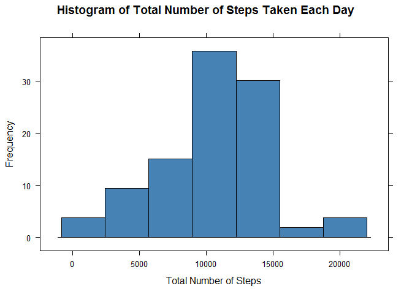

# Reproducible Research: Peer Assessment 1
Hariharan D  
Saturday, 08^th^ July 2017  

<style>
body {
text-align: justify}
</style>

### Introduction

It is now possible to collect a large amount of data about personal movement using activity monitoring devices such as a Fitbit, Nike Fuelband, or Jawbone Up. These type of devices are part of the "quantified self" movement - a group of enthusiasts who take measurements about themselves regularly to improve their health, to find patterns in their behavior, or because they are tech geeks. But these data remain under-utilized both because the raw data are hard to obtain and there is a lack of statistical methods and software for processing and interpreting the data.

This assignment makes use of data from a personal activity monitoring device. This device collects data at 5 minute intervals through out the day. The data consists of two months of data from an anonymous individual collected during the months of October and November, 2012 and include the number of steps taken in 5 minute intervals each day.

This document contains necessary code and output report that answers the questions detailed in this assignment, using a single **R Markdown** document that can be processed by **knitr** and be transformed into an **HTML file**.


### Set Options and Load R Library

Set the chunk options.


```r
library(knitr)

knitr::opts_chunk$set(echo = TRUE, tidy = TRUE, message = FALSE, fig.align = "center")
```

Load the necessary libraries.

Note: It is assumed that the below libraries are aready installed.


```r
library(plyr)

library(dplyr)

library(lattice)

library(ggplot2)
```


### Loading and preprocessing the data

* Load the data (i.e. read.csv())

Note: It is assumed that **activity.csv** file is already downloaded from **[here](https://d396qusza40orc.cloudfront.net/repdata%2Fdata%2Factivity.zip)**, unzipped and saved in the working directory.


```r
activity_data <- read.csv("activity.csv", header = TRUE, sep = ",", stringsAsFactors = FALSE)

str(activity_data)
```

```
## 'data.frame':	17568 obs. of  3 variables:
##  $ steps   : int  NA NA NA NA NA NA NA NA NA NA ...
##  $ date    : chr  "2012-10-01" "2012-10-01" "2012-10-01" "2012-10-01" ...
##  $ interval: int  0 5 10 15 20 25 30 35 40 45 ...
```

```r
summary(activity_data)
```

```
##      steps            date              interval     
##  Min.   :  0.00   Length:17568       Min.   :   0.0  
##  1st Qu.:  0.00   Class :character   1st Qu.: 588.8  
##  Median :  0.00   Mode  :character   Median :1177.5  
##  Mean   : 37.38                      Mean   :1177.5  
##  3rd Qu.: 12.00                      3rd Qu.:1766.2  
##  Max.   :806.00                      Max.   :2355.0  
##  NA's   :2304
```

```r
head(activity_data)
```

```
##   steps       date interval
## 1    NA 2012-10-01        0
## 2    NA 2012-10-01        5
## 3    NA 2012-10-01       10
## 4    NA 2012-10-01       15
## 5    NA 2012-10-01       20
## 6    NA 2012-10-01       25
```

```r
tail(activity_data)
```

```
##       steps       date interval
## 17563    NA 2012-11-30     2330
## 17564    NA 2012-11-30     2335
## 17565    NA 2012-11-30     2340
## 17566    NA 2012-11-30     2345
## 17567    NA 2012-11-30     2350
## 17568    NA 2012-11-30     2355
```

* Process/transform the data (if necessary) into a format suitable for your analysis

Subsetting data to remove "NA" values. Formatting variable "date" from "Character" to "Date" format


```r
activity_pattern <- subset(activity_data, !is.na(activity_data$steps))

activity_pattern$date <- as.Date(activity_pattern$date, format = "%Y-%m-%d")
```

### What is mean total number of steps taken per day?

For this part of the assignment, you can ignore the missing values in the dataset.


* Calculate the total number of steps taken per day

Use **"ddply()"** function from **"plyr"** package to summarize steps grouped by date.


```r
total_steps <- ddply(activity_pattern, .(date), summarize, steps = sum(steps))
```


* If you do not understand the difference between a histogram and a barplot, research the difference between them. Make a histogram of the total number of steps taken each day

Use **"histogram()"** function from **"lattice"** package to plot the total number of steps taken each day.


```r
histogram(~steps, data = total_steps, pch = 19, main = "Histogram of Total Number of Steps Taken Each Day", 
    xlab = "Total Number of Steps", ylab = "Frequency", col = "steelblue")
```




* Calculate and report the mean and median of the total number of steps taken per day

Use **"mean()"** and **"median()"** function to calculate the Mean and Median of the total number of steps taken per day.


```r
mean_steps <- mean(total_steps$steps)

mean_steps
```

```
## [1] 10766.19
```

```r
median_steps <- median(total_steps$steps)

median_steps
```

```
## [1] 10765
```


### What is the average daily activity pattern?

* Make a time series plot (i.e. type = "l") of the 5-minute interval (x-axis) and the average number of steps taken, averaged across all days (y-axis)

Use **"ddply()"** function from **"plyr"** package to summarize steps grouped by interval. Plot a time series with the interval and average number of steps taken across all days using **"ggplot()"** function from **"ggplot2"** package.


```r
interval_steps <- ddply(activity_pattern, .(interval), summarize, steps = mean(steps))

ggplot(interval_steps, aes(x = interval, y = steps)) + geom_line(size = 0.8, 
    color = "steelblue") + labs(title = "Average Number of Steps Taken During 5 Minute Interval", 
    x = "Interval (in Minutes)", y = "Average Number of Steps Taken") + theme_bw() + 
    theme(plot.title = element_text(hjust = 0.5))
```


* Which 5-minute interval, on average across all the days in the dataset, contains the maximum number of steps?

Calculate maximum number of steps across 5-minute interval averaged across all the days using **"which()"** and **"max()"** function


```r
interval_steps[which.max(interval_steps$steps), ]
```

```
##     interval    steps
## 104      835 206.1698
```


### Imputing missing values

Note that there are a number of days/intervals where there are missing values (coded as NA). The presence of missing days may introduce bias into some calculations or summaries of the data.


* Calculate and report the total number of missing values in the dataset (i.e. the total number of rows with NAs)

Calculate the total number of missing values in the dataset using **"sum()"** and **"is.na()"** function.


```r
sum(is.na(activity_data$steps))
```

```
## [1] 2304
```

```r
sum(is.na(interval_steps$steps))
```

```
## [1] 0
```


* Devise a strategy for filling in all of the missing values in the dataset. The strategy does not need to be sophisticated. For example, you could use the mean/median for that day, or the mean for that 5-minute interval, etc.

Fill missing values in the data set with the average number of steps for each interval across all of the days using the **"merge()"** function.


```r
colnames(interval_steps) <- c("interval", "mean_steps")

activity_impute <- merge(activity_data, interval_steps, by = "interval")
```


* Create a new dataset that is equal to the original dataset but with the missing data filled in.

Fill the missing values os steps in the original data set and validate the same.


```r
activity_impute$steps[is.na(activity_impute$steps)] <- activity_impute$mean_steps[is.na(activity_impute$steps)]

sum(is.na(activity_impute$steps))
```

```
## [1] 0
```


* Make a histogram of the total number of steps taken each day and Calculate and report the mean and median total number of steps taken per day. Do these values differ from the estimates from the first part of the assignment? What is the impact of imputing missing data on the estimates of the total daily number of steps?

Use **"histogram()"** function from **"lattice"** package to plot the total number of steps taken each day with missing values filled-in. Use **"mean()"** and **"median()"** function to re-calculate the Mean and Median of the total number of steps taken per day with missing values filled-in.


```r
activity_impute$date <- as.Date(activity_impute$date, format = "%Y-%m-%d")

impute_steps <- ddply(activity_impute, .(date), summarize, steps = sum(steps))

histogram(~steps, data = impute_steps, pch = 19, main = "Histogram of Total Number of Steps Taken Each Day", 
    xlab = "Total Number of Steps", ylab = "Frequency", col = "steel blue")
```


```r
impute_mean_steps <- mean(impute_steps$steps)

impute_mean_steps
```

```
## [1] 10766.19
```

```r
impute_median_steps <- median(impute_steps$steps)

impute_median_steps
```

```
## [1] 10766.19
```

Mean is unaffected by data imputation while there is change in Median value.

### Are there differences in activity patterns between weekdays and weekends?

For this part the weekdays() function may be of some help here. Use the dataset with the filled-in missing values for this part.


* Create a new factor variable in the dataset with two levels - "weekday" and "weekend" indicating whether a given date is a weekday or weekend day.

Create a new column in the dataset to hold the weekday and weekend information as factors which is calculated using **"weekdays()"** and **"as.factor()"** functions.


```r
activity_impute$day_of_week <- weekdays(activity_impute$date)

activity_impute$weekend <- as.factor(activity_impute$day_of_week == "Saturday" | 
    activity_impute$day_of_week == "Sunday")

levels(activity_impute$weekend) <- c("Weekday", "Weekend")
```


* Make a panel plot containing a time series plot (i.e. type = "l") of the 5-minute interval (x-axis) and the average number of steps taken, averaged across all weekday days or weekend days (y-axis). See the README file in the GitHub repository to see an example of what this plot should look like using simulated data.

Use **"ddply()"** function from **"plyr"** package to summarize steps grouped by interval and weekend. Plot a time series with the interval and average number of steps taken across all days for weekday and weekend using **"ggplot()"** function from **"ggplot2"** package.


```r
week_steps <- ddply(activity_impute, .(interval, weekend), summarize, steps = mean(steps))

ggplot(week_steps, aes(x = interval, y = steps, color = weekend)) + geom_line(size = 0.8) + 
    facet_grid(weekend ~ .) + labs(title = "Average Number of Steps Taken During Weekday and Weekend", 
    x = "Interval (in Minutes)", y = "Average Number of Steps Taken") + theme_bw() + 
    theme(plot.title = element_text(hjust = 0.5))
```


